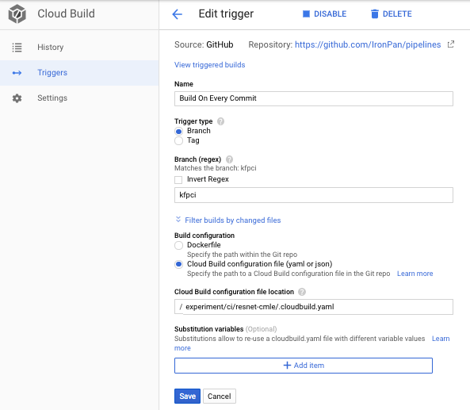
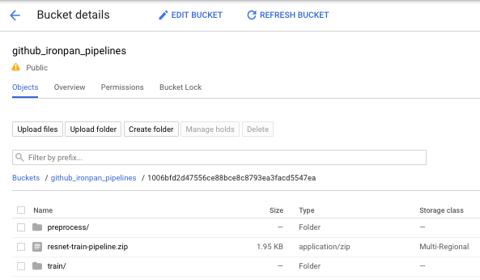

# Continuous Integration For Kubeflow Pipelines 

In this sample we will setup a Continuous Integration environment for developing a Kubeflow Pipeline, using [Google Cloud Build](https://cloud.google.com/cloud-build/)

The pipeline consists of two steps
- preprocess using [Cloud Dataflow](https://cloud.google.com/dataflow/). The source code locates in [preprocess/](preprocess)
- training using [Cloud ML Engine](https://cloud.google.com/ml-engine/). The source code locates in [train/](train)

## Setup

- Fork the code to your own git repo.
- Go to your [cloud build](https://pantheon.corp.google.com/cloud-build) page, and set up cloud build to point to the [.cloudbuild.yaml](.cloudbuild.yaml), similar to below.

- Create a GCS bucket in the same project with the name of your repo
    ```
    gsutil mb gs://github_[your_github_username]_pipelines
    ```
- And you are all set. If you edit the source code, the cloud build would trigger a new job. The job will 
  - Package the latest Dataflow and CMLE code to the GCS bucket, under a git commit SHA versioned subfolder.
  - Compile the latest Pipeline code to a tarball package, pointing to the latest Dataflow/CMLE code. The package is ready to upload to Kubeflow Pipeline UI.



## TODO
- [x] connect github to cloud build
- [x] cloud build step to package code
- [x] cloud build step to compile package
- [x] cloud build step to upload package to KFP endpoint

- [x] add pipeline version API to KFP backend
- [x] add pipeline version view to KFP UI

- [x] add hello world CI sample to build docker image
- [ ] add TFX sample

- [x] local run/testing
